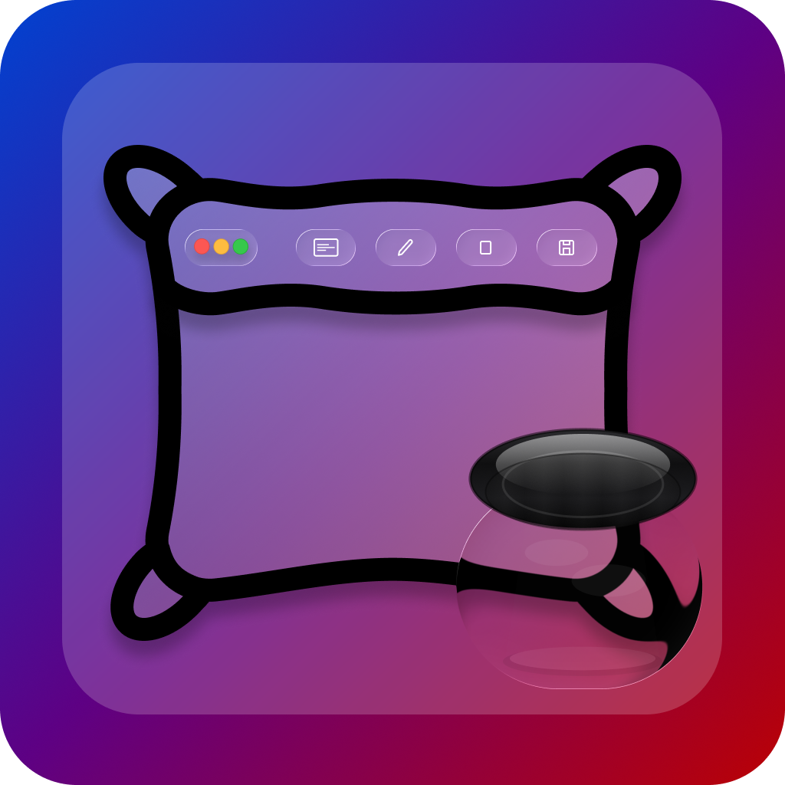

# ComfyMark



ComfyMark is a lightweight, open-source screenshot + markup tool for macOS.  
Take a screenshot with a single hotkey, edit it instantly, and save it — all from your menu bar.

## ✨ Features
- No Real Features Yet, Still WIP

## 🗺️ Roadmap
- [x] Metal-accelerated image rendering
- [x] Basic stroke/pen annotation
- [x] Menu bar integration
- [ ] Screenshot capture hotkeys
- [ ] Shape tools (rectangles, arrows, etc.)
- [ ] Text annotations
- [ ] Background blur/pixelation
- [ ] Export formats (PNG, JPG, clipboard)

## ❓ Why ComfyMark?
macOS already has built-in screenshots, and there are paid tools like CleanShot X —  
so why make another one?

- Fuck Paywalls (I respect it) but still, if I need something fast theres nothing fast out there
- 🖥️ **Built for developers** — made in Swift, easy to extend or hack on.
- 🎨 **Future-focused** — planned GPU/Metal acceleration for real-time editing.
- 🤦 **The breaking point** — I downloaded a free app from the App Store, and it hit me with a paywall just to edit a screenshot. That was it. Time to build my own.

## 📷 Screenshots


## 🛠 Installation
Clone the repo and build in **Xcode 16+** (macOS 15/Sequoia or later).  
App Store release coming soon.

```bash
git clone https://github.com/AryanRogye/ComfyMark.git
cd ComfyMark
open ComfyMark.xcodeproj
```
