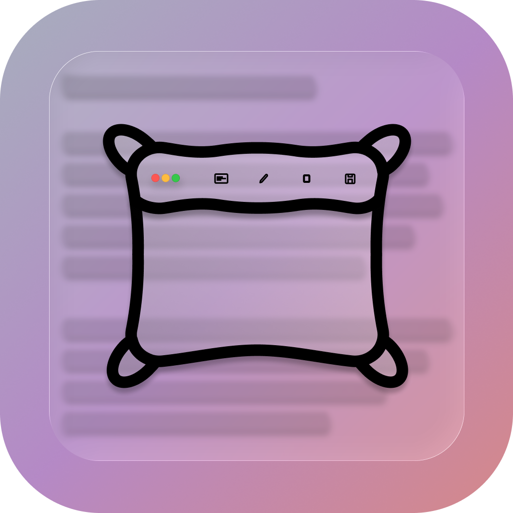

# ComfyMark



ComfyMark is a lightweight, open-source screenshot + markup tool for macOS.  
Take a screenshot with a single hotkey, edit it instantly, and save it — all from your menu bar.

## ✨ Features
- Can take a screenshot of the entire screen
- Export as PNG, JPG, or PDF

## 🗺️ Roadmap
- [x] Metal-accelerated image rendering
- [x] Basic stroke/pen annotation
- [x] Menu bar integration
- [x] Metal-accelerated drawing on screen
  - [ ] Include more options for brush types,
  - [x] Brush size/radius change
  - [ ] Nice color picker, something native or also look at colorPicker
- [x] Erase
- [ ] Allow Default Screenshot Resolution Picker in Settings
- [ ] Undo and Redo
- [x] Saving menu bar state
- [x] Screenshot capture hotkeys
- [ ] Shape tools (rectangles, arrows, etc.)
- [ ] I rlly want a spotlight, for me
- [ ] Text annotations
- [ ] Background blur/pixelation
  - [ ] think i can look at different blurs and where they are, what they are behind etc
- [x] Export formats (PNG, JPG, clipboard)
  - [x] Export the edited image

## ❓ Why ComfyMark?
macOS already has built-in screenshots, and there are paid tools like CleanShot X —  
so why make another one?

- I dont like Paywalls (I respect it) but still, if I need something fast theres nothing fast out there
- 🖥️ **Built for developers** — made in Swift, easy to extend or hack on.
- 🎨 **Future-focused** — planned GPU/Metal acceleration for real-time editing.
- 🤦 **The breaking point** — I downloaded a free app from the App Store, and it hit me with a paywall just to edit a screenshot. That was it. Time to build my own.

## 📷 Screenshots


## Demo

<video width="500" height="500" alt="Demo" src="https://github.com/user-attachments/assets/f13313df-43ae-4c62-8092-4152ca6254ca" />


## 🛠 Installation
Clone the repo and build in **Xcode 16+** (macOS 15/Sequoia or later).  
App Store release coming soon.

```bash
git clone https://github.com/AryanRogye/ComfyMark.git
cd ComfyMark
open ComfyMark.xcodeproj
```
